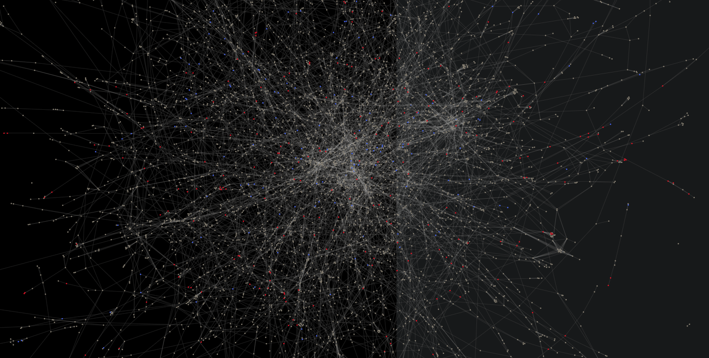

# Linguistic Geometry, and Attempts at Novel Computational Linguistic Modeling

What is the structure and geometry behind [written] language (mostly from a graph theory perspective)? 

Is there a relationship between sequential character level networks (meaning the network where any possible walk forms a word, e.g., "w->o->r->d") and semantic networks (synonym networks)?

Some notebooks may come off as cryptic as I explore new topics.

Another computational linguistics project: [Haiku bot](https://github.com/bfbarry/HaikuBot)

Some TODO and questions:
- assign functions (eg probability distributions, spatial functions) and set theoretic attributes to words
- Look at lifetime of words: when and why do words become 'archaic'? (is there a characteristic frequency that allows a word to propagate)
- What kind of shift occurs between words from the dictionary vs encyclopaedia/internet?

Some thoughts and questions on symbolic dynamics:
- Plane partition defined as a [di]graph:
    - Nodes as initial conditions
     - For each word/letter/symbol, find its neighbors (i.e. the word/letter/symbol that can appropriately follow, based on its corpus)
     - How to determine this graph efficiently?
        - Apply some rules: 1. no repeated words, unless it's a "function" (e.g. great- great grandmother)
        - Can you infer dynamics based on graph connectivity?
    - What does the dual represent?
- When and where do fixed points appear? (stopping points for writing a letter?)
    - Type of language affects dynamics: e.g. not many centers in human language, but yes in computer languages ("while true")
- How to relate composite symbolic dimensions? (e.g. curves--> letters-->words-->sentences)
- Latent space for some language:
    - Partition scheme + connectivity changes the alphabet (think english vs mandarin)
        - What does the transformation of partition geometry and connectivity look like b/w langauges?  Are they a type of isomorphism?
    - Higher level symbolic languages, like at the level of sentences, overlap a lot more or are even identical.  Why?  How can languages built from different alphabetic symbols achieve this?  What does it say about language etc.
- Cross dimensional comparison: how does the number of nodes/partitions per dimension vary, and how does it reflect connectivity?
    - For letters: do we know/how would we know if symbolic partitions are the same (e.g. the curves in the letters "Z", "X" look similar but are they really?)
- Letters
    - Are curves like in "O" one symbol or multiple?
    - Inferring partition scheme from the flow of writing the letter (the hand movement is in fact the dynamics)
    - Are all letters and symbols shared in the same state space?
    - How do we know if it's not a 3d projection onto 2d?
    - How to accomodate for both smooth and straight curves in the same plane?  How to account for discontinuities? (e.g. "Q")
        - Can use clues from artifacts like "w" is "double u"
        - Maybe the flows are the symbols themselves, or at least pretty close; so partitioning maybe isn't necessary?
        - Some vectors are curved, others are not: each parition has a range of "bend"
- Meta math: does vector field and partition location affect computation itself?  Like location of "+" and "-" on some abstract space.  (probably yes, see the number line)

Other:
- generative grammar
- Modelling memory: diffusion on language: need to find a way to perform PCA on sentences with respect to semantics.  
    - and working backwards: with diffused sentence how to generate new semantic structures